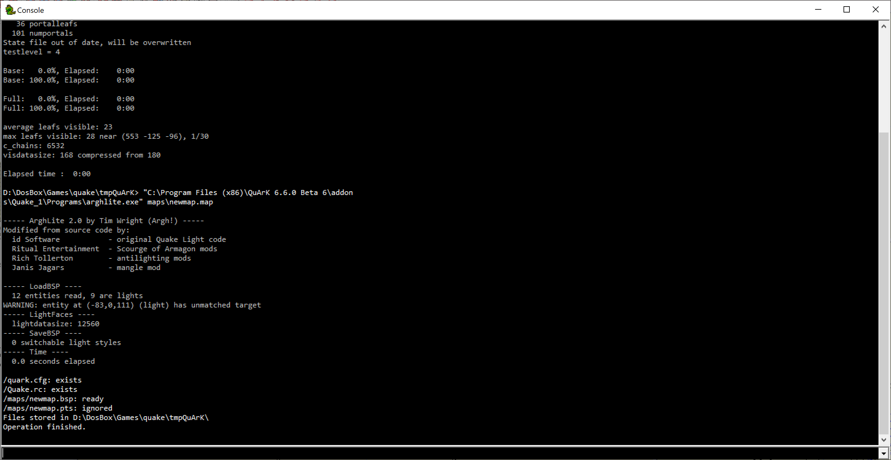
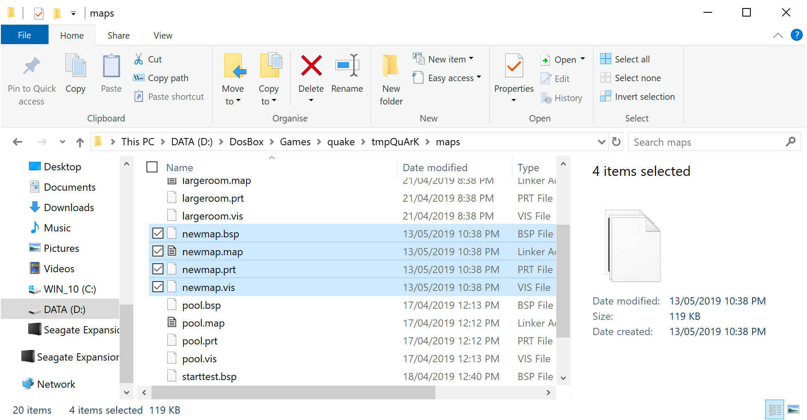

# Maps
newmap.qkm is simply a test to see if your QuArK is setup right.

To setup QuArK, go download and install it first.
Then set the game to Quake 1 and make a new map. I suggest just playing around with everything to figure out how stuff works however, there is a tutorial here: http://quark.sourceforge.net/infobase/maped.tutorial.starting.html

If you want to try out the map inside of quake, you are going to have to find a version of quake or use the compiled engine in the Engine repository. Then you are going to have to get the build tools from http://quark.sourceforge.net/download_tools.php You need the Enhanced Txqbsp, Enhance RVIS/Light/BspInfo utilities, and arghlite. After downloading and extracting these programs go into QuArK and navigate to the configuration for Quake 1. Scroll down to the build programs execuion sequence section and point the first program to the extracted Txqbsp.exe. The second program to the VIS.exe. The third program to arghlite.exe. Then click OK. After this is done, you should be able to hit GO in the Quake 1 menu at the top (or just Ctrl+R). The console that pops up should tell you where the map is located. Copy the .bsp, .map, .prt, .vis into a folder called maps. Copy this folder into another foler called id1. Copy this id1 folder to the engine exe location. Then you can run the engine (or quake) and then in the console type `map <mapname>` (open the console by pressing ~). This should load up the map.

1. Point QuArK to quake.exe

2. Point QuArK to build tools

3. Compile map

4. Copy map files

5. Test out map

